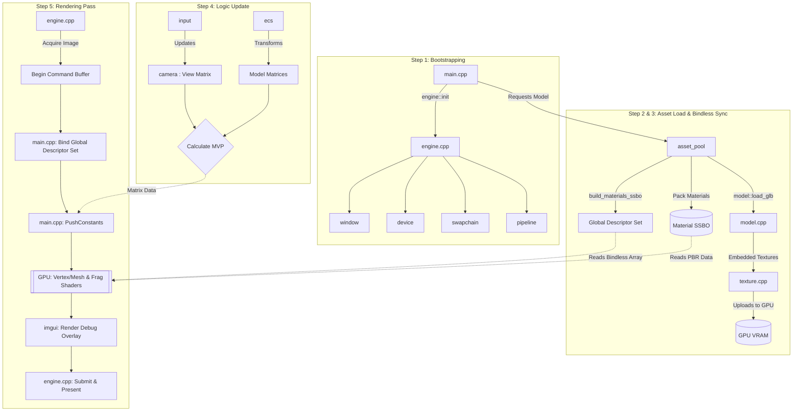

```mermaid
graph TD
    %% Phase 1
    subgraph Step 1: Bootstrapping
        Main1[main.cpp] -->|engine::init| Engine[engine.cpp]
        Engine --> Win[window]
        Engine --> Dev[device]
        Engine --> Swap[swapchain]
        Engine --> Pipe[pipeline]
    end

    %% Phase 2 & 3
    subgraph Step 2 & 3: Asset Load & Bindless Sync
        Main1 -->|Requests Model| Pool[asset_pool]
        Pool -->|model::load_glb| Mod[model.cpp]
        Mod -->|Embedded Textures| Tex[texture.cpp]
        Tex -->|Uploads to GPU| VRAM[(GPU VRAM)]
        
        Pool -->|build_materials_ssbo| Desc[Global Descriptor Set]
        Pool -->|Pack Materials| SSBO[(Material SSBO)]
    end

    %% Phase 4
    subgraph Step 4: Logic Update
        Inp[input] -->|Updates| Cam[camera : View Matrix]
        ECS[ecs] -->|Transforms| ModelMat[Model Matrices]
        Cam --> MVP{Calculate MVP}
        ModelMat --> MVP
    end

    %% Phase 5
    subgraph Step 5: Rendering Pass
        EngFrame[engine.cpp] -->|Acquire Image| Cmd[Begin Command Buffer]
        Cmd --> BindSet[main.cpp: Bind Global Descriptor Set]
        BindSet --> Push[main.cpp: PushConstants]
        
        MVP -.->|Matrix Data| Push
        
        Push --> GPU[[GPU: Vertex/Mesh & Frag Shaders]]
        
        Desc -.->|Reads Bindless Array| GPU
        SSBO -.->|Reads PBR Data| GPU
        
        GPU --> UI[imgui: Render Debug Overlay]
        UI --> Present[engine.cpp: Submit & Present]
    end
```
